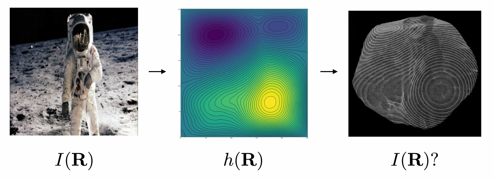

# MagicWindow

An implementation of 'Laplacian magic windows' by Michael Berry (https://doi.org/10.1088/2040-8986/aa6c4e).

To generate the image $I(\mathbf{R})$ at a distance $z$ from the first surface of a material with refractive index $n$, the shape of the second surface, $h(\mathbf{R})$, is computed by solving the Poisson equation

$$ \nabla^2 h(\mathbf{R}) = \frac{1 - I(\mathbf{R})}{(n - 1) z} $$

with Dirichlet boundary conditions. This is done by solving the discrete Poisson equation using the Jacobi method. A mesh of the surface profile is constructed in Open3D, and the resulting `.obj` file is saved.

  

